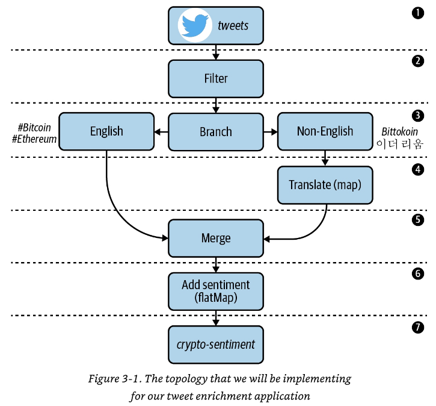

# kafka-streams-sandbox

Kafka streams examples collection.

## Kafka CLI

Install kafka cli tools using https://github.com/sauljabin/kafka-cli-installer.

## Kafka Cluster

Run kafka cluster:

```shell
cd kafka-cluster
docker compose up -d
```

Shutdown:

```shell
cd kafka-cluster
docker compose down
```

Open http://localhost:8080/ on the browser.

## 1. Sentiment Analysis of Cryptocurrency Tweets

> Copyright © 2021 Mitch Seymour. All rights reserved. [Mastering Kafka Streams and ksqlDB](https://github.com/mitch-seymour/mastering-kafka-streams-and-ksqldb).

In this tutorial, we will explore the use case of algorithmic trading.
Sometimes called high-frequency trading (HFT), this lucrative practice involves building software to evaluate and
purchase securities automatically, by processing and responding to many types of market signals with minimal latency. To
assist our fictional trading software, we will build a stream processing application that will help us gauge market
sentiment around different types of cryptocurrencies (Bitcoin, Ethereum, Ripple, etc.), and use these sentiment scores
as investment/divestment signals in a custom trading algorithm.

Since millions of people use Twitter to share their thoughts on cryptocurrencies and other topics, we will use Twitter
as the data source for our application. Before we get started, let’s look at the steps required to build our stream
processing application. We will then use these requirements to design a processor topology, which will be a helpful
guide as we build our stateless Kafka Streams application. The key concepts in each step are italicized:

1. Tweets that mention certain digital currencies (#bitcoin, #ethereum) should be consumed from a source topic called
   tweets:
    * Since each record is JSON-encoded, we need to figure out how to properly deserialize these records into
      higher-level data classes.
    * Unneeded fields should be removed during the deserialization process to simplify our code. Selecting only a
      subset of fields to work with is referred to as projection, and is one of the most common tasks in stream
      processing.
2. Retweets should be excluded from processing. This will involve some form of data filtering.
3. Tweets that aren’t written in English should be branched into a separate stream for translating.
4. Non-English tweets need to be translated to English. This involves mapping one input value (the non-English tweet) to
   a new output value (an English-translated tweet).
5. The newly translated tweets should be merged with the English tweets stream to create one unified stream.
6. Each tweet should be enriched with a sentiment score, which indicates whether Twitter users are conveying positive or
   negative emotion when discussing certain digital currencies. Since a single tweet could mention multiple
   cryptocurrencies, we will demonstrate how to convert each input (tweet) into a variable number of outputs using a
   flatMap operator.
7. The enriched tweets should be serialized using Avro, and written to an output topic called crypto-sentiment. Our
   fictional trading algorithm will read from this topic and make investment decisions based on the signals it sees.



Create a `tweets` topic:

```shell
kafka-topics --create --bootstrap-server localhost:19092 \
  --replication-factor 2 --partitions 3 \
  --topic tweets
```

Create a `crypto-sentiment` topic:

```shell
kafka-topics --create --bootstrap-server localhost:19092 \
  --replication-factor 2 --partitions 3 \
  --topic crypto-sentiment
```

Run exercise:

```shell
./gradlew sentiment-analysis:run
```

Produce tweets:

```shell
kafka-console-producer --bootstrap-server localhost:19092 \
  --topic tweets < sentiment-analysis/data/tweets.json
```