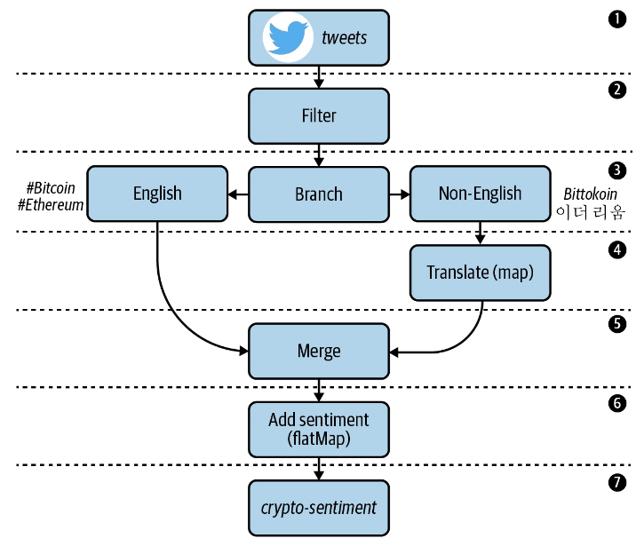

# kafka-streams-sandbox

Kafka streams examples collection.

## Kafka CLI

Install kafka cli tools using https://github.com/sauljabin/kafka-cli-installer.

## Kafka Cluster

Run kafka cluster:

```shell
cd kafka-cluster
docker compose up -d
```

Shutdown:

```shell
cd kafka-cluster
docker compose down
```

Open http://localhost:8080/ on the browser.

## 1. Sentiment Analysis of Cryptocurrency Tweets

> Copyright © 2021 Mitch Seymour. All rights
> reserved. [Mastering Kafka Streams and ksqlDB](https://github.com/mitch-seymour/mastering-kafka-streams-and-ksqldb).

Sometimes called high-frequency trading (HFT), this lucrative practice involves building software to evaluate and
purchase securities automatically, by processing and responding to many types of market signals with minimal latency. To
assist our fictional trading software, we will build a stream processing application that will help us gauge market
sentiment around different types of cryptocurrencies (Bitcoin, Ethereum, Ripple, etc.), and use these sentiment scores
as investment/divestment signals in a custom trading algorithm.

1. Tweets that mention certain digital currencies (#bitcoin, #ethereum) should be consumed from a source topic called
   tweets:
    * Since each record is JSON-encoded, we need to figure out how to properly deserialize these records into
      higher-level data classes.
    * Unneeded fields should be removed during the deserialization process to simplify our code. Selecting only a
      subset of fields to work with is referred to as projection, and is one of the most common tasks in stream
      processing.
2. Retweets should be excluded from processing. This will involve some form of data filtering.
3. Tweets that aren’t written in English should be branched into a separate stream for translating.
4. Non-English tweets need to be translated to English. This involves mapping one input value (the non-English tweet) to
   a new output value (an English-translated tweet).
5. The newly translated tweets should be merged with the English tweets stream to create one unified stream.
6. Each tweet should be enriched with a sentiment score, which indicates whether Twitter users are conveying positive or
   negative emotion when discussing certain digital currencies. Since a single tweet could mention multiple
   cryptocurrencies, we will demonstrate how to convert each input (tweet) into a variable number of outputs using a
   flatMap operator.
7. The enriched tweets should be serialized using Avro, and written to an output topic called crypto-sentiment. Our
   fictional trading algorithm will read from this topic and make investment decisions based on the signals it sees.



Create a topics:

```shell
kafka-topics --create --bootstrap-server localhost:19092 \
  --replication-factor 2 --partitions 3 \
  --topic tweets

kafka-topics --create --bootstrap-server localhost:19092 \
  --replication-factor 2 --partitions 3 \
  --topic crypto-sentiment
```

Run exercise:

```shell
./gradlew sentiment-analysis:run
```

Produce tweets:

```shell
kafka-console-producer --bootstrap-server localhost:19092 \
  --topic tweets < sentiment-analysis/data/tweets.json
```

## 2. Game Leaderboard

> Copyright © 2021 Mitch Seymour. All rights
> reserved. [Mastering Kafka Streams and ksqlDB](https://github.com/mitch-seymour/mastering-kafka-streams-and-ksqldb).

The video game industry is a prime example of where stream processing excels, since both gamers and game systems require
low-latency processing and immediate feedback. This is one reason why companies like Activision use Kafka Streams for
processing video game telemetry.

1. Our Kafka cluster contains three topics:
    * The `score-events` topic contains game scores. The records are unkeyed and are therefore distributed in a
      round-robin fashion across the topic’s partitions.
    * The `players` topic contains player profiles. Each record is keyed by a player ID.
    * The `products` topic contains product information for various video games. Each record is keyed by a product ID.
2. We need to enrich our score events data with detailed player information. We can accomplish this using a join.
3. Once we’ve enriched the score-events data with player data, we need to add detailed product information to the
   resulting stream. This can also be accomplished using a join.
4. Since grouping data is a prerequisite for aggregating, we need to group the enriched stream.
5. We need to calculate the top three high scores for each game. We can use Kafka Streams’ aggregation operators for
   this purpose.
6. Finally, we need to expose the high scores for each game externally. We will accomplish this by building a RESTful
   microservice using the interactive queries feature in Kafka Streams.


| Topic          | Abstraction  | Reason                                                                                                        |
|----------------|--------------|---------------------------------------------------------------------------------------------------------------|
| `score-events` | KStream      | This topic is unkeyed. In addition, we want the highest score not the latest score                            |
| `players`      | KTable       | It's a compacted topic and we only care about the latest state of the player                                  |
| `products`     | GlobalKTable | It's a compacted topic and has a fixed number of products, meaning it has a small keyspace between partitions | 

Create a topics:

```shell
kafka-topics --create --bootstrap-server localhost:19092 \
  --replication-factor 2 --partitions 3 \
  --topic score-events

kafka-topics --create --bootstrap-server localhost:19092 \
  --replication-factor 2 --partitions 3 \
  --config cleanup.policy=compact \
  --topic players

kafka-topics --create --bootstrap-server localhost:19092 \
  --replication-factor 2 --partitions 3 \
  --config cleanup.policy=compact \
  --topic products

kafka-topics --create --bootstrap-server localhost:19092 \
  --replication-factor 2 --partitions 3 \
  --topic high-scores
```

Run exercise:

```shell
./gradlew game-leaderboard:run
```

Produce data:

```shell
kafka-console-producer \
  --bootstrap-server localhost:19092 \
  --topic players \
  --property 'parse.key=true' \
  --property 'key.separator=|' < game-leaderboard/data/players.json

kafka-console-producer \
  --bootstrap-server localhost:19092 \
  --topic products \
  --property 'parse.key=true' \
  --property 'key.separator=|' < game-leaderboard/data/products.json

kafka-console-producer \
  --bootstrap-server localhost:19092 \
  --topic score-events < game-leaderboard/data/score-events.json
```

## 3. Patient Monitoring

> Copyright © 2021 Mitch Seymour. All rights
> reserved. [Mastering Kafka Streams and ksqlDB](https://github.com/mitch-seymour/mastering-kafka-streams-and-ksqldb).

This exercise try to detect the presence of a medical condition called `systemic inflammatory response syndrome`, or
SIRS. There are several vital signs, including body temperature, blood pressure, and heart rate, that can be used as
indicators of SIRS. In this
tutorial, we will look at two of these measurements: body temperature and heart rate. When both of these vitals reach
predefined thresholds (`heart rate >= 100` beats per minute, `body temperature >= 100.4°F`), we will send a record to an
alerts topic to notify the appropriate medical personnel.

1. Our Kafka cluster contains two topics that capture patient vitals measurements:
    * The `pulse-events` topic is populated by a heartbeat sensor. Every time the sensor picks up a patient’s heartbeat,
      it appends a record to this topic. Records are keyed by patient ID.
    * The body-temp-events topic is populated by a wireless body temperature sensor. Every time the patient’s core body
      temperature is taken, a record is appended to this topic. These records are also keyed by patient ID.
2. In order to detect elevated heart rates, we need to convert the raw pulse events into a heart rate (measured using
   beats per minute, or bpm). As we learned in the previous chapter, we must first group the records to satisfy Kafka
   Streams’ prerequisite for performing aggregations.
3. We will use a windowed aggregation to convert the pulse events into a heart rate. Since our unit of measurement is
   beats per minute, our window size will be 60 seconds.
4. We will use the `suppress` operator to only emit the final computation of the bpm window. We’ll see why this is
   needed once we discuss this operator later in the chapter.
5. In order to detect an infection, we will filter all vitals measurements that breach a set of predefined
   thresholds (`heart rate >= 100` beats per minute, body `temperature >= 100.4°F`).
6. As we’ll see shortly, windowed aggregations change the record key. Therefore, we’ll need to rekey the heart rate
   records by patient ID to meet the co-partitioning requirements for joining records.
7. We will perform a windowed join to combine the two vitals streams. Since we are performing the join after filtering
   for elevated bpm and body temperature measures, each joined record will indicate an alerting condition for SIRS.
8. Finally, we will expose the results of our heart rate aggregation via interactive queries. We will also write the
   output of our joined stream to a topic called alerts.


Create a topics:

```shell
kafka-topics --create --bootstrap-server localhost:19092 \
  --replication-factor 2 --partitions 3 \
  --topic pulse-events

kafka-topics --create --bootstrap-server localhost:19092 \
  --replication-factor 2 --partitions 3 \
  --topic body-temp-events

kafka-topics --create --bootstrap-server localhost:19092 \
  --replication-factor 2 --partitions 3 \
  --topic sirs-alerts

kafka-topics --create --bootstrap-server localhost:19092 \
  --replication-factor 2 --partitions 3 \
  --topic bpm
```

Run exercise:

```shell
./gradlew patient-monitoring:run
```

Produce data:

```shell
kafka-console-producer \
  --bootstrap-server localhost:19092 \
  --topic pulse-events \
  --property 'parse.key=true' \
  --property 'key.separator=|' < patient-monitoring/data/pulse-events.json

kafka-console-producer \
  --bootstrap-server localhost:19092 \
  --topic body-temp-events \
  --property 'parse.key=true' \
  --property 'key.separator=|' < patient-monitoring/data/body-temp-events.json
```